<a href="https://campingping.com/" target="_blank">

</a>

<br/>
<br/>

# 0. Getting Started (시작하기)

```bash
$ npm run start
```

[서비스 링크](https://campingping.com/)

<br/>
<br/>

# 1. Project Overview (프로젝트 개요)

- 프로젝트 이름: 캠핑핑
- 캠핑장에서 실시간 소통과 정보 공유를 지원하는 위치 기반 캠핑 커뮤니티 플랫폼
- **핵심 문제점** : 기존 캠핑 관련 서비스는 정보 검색과 리뷰, 결제 기능에 치중되어 있어, 캠핑장에서의 실시간 소통과 교류가 어려움. 캠핑장에 온 사람들 간 공동 활동을 계획하거나 정보를 빠르게 공유할 플랫폼 부재.
- **프로젝트 목표** : 기존 서비스들의 게시글 형태 소통 방식에 위치 기반, 실시간 채팅 기능을 더해 캠핑장 방문객들이 실시간으로 정보를 공유하고, 같은 장소에 있는 사용자들과 소통하며 새로운 형태의 캠핑 커뮤니티를 형성하는 것.

  <br/>
  <br/>

# 2. Team Members (팀원 및 팀 소개)

|                          김영현                           |                           백기준                           |                                 김지연                                  |                           최준영                           |
| :-------------------------------------------------------: | :--------------------------------------------------------: | :---------------------------------------------------------------------: | :--------------------------------------------------------: |
|  |  |  |  |
|                            BE                             |                             BE                             |                                   FE                                    |                             FE                             |
|          [GitHub](https://github.com/zerohyun00)          |            [GitHub](https://github.com/KK10024)            |                  [GitHub](https://github.com/yeonn-k)                   |     [GitHub](https://kdt-gitlab.elice.io/junyoungchoi)     |

<br/>
<br/>

# 3. Key feature (주요 기능)

### 1. 위치 기반 캠핑장 정보 필터링 기능

- 사용자의 위치에 맞는 캠핑장 정보를 카테고리 , 지역별로 필터링 해서 제공합니다.
- 필터링 할 수 있는 항목 에는 다음과 같은 정보가 포함됩니다:
  - **지역별**: 서울특별시 , 경기도, 부산광역시 등 지역별로 필터링 가능
  - **일반야영장**
  - **자동차야영장**
  - **카라반**
  - **글램핑**
  - **캠프닉**
  - **산**
  - **숲**
  - **계곡**
  - **바다**
  - **해변**
  - **섬**
  - **강**
  - **호수**
  - **도시**
  - **반려동물**

### 2. 위치 기반 커뮤니티 기능

- 사용자의 반경 1.5km 이내에 다른 사용자가 올린 게시물을 볼 수 있고, 소통할 수 있습니다.
  - **게시물 CRUD**: 서버에서 가져온 팀원 목록에서 필요한 팀원을 선택하여 일정에 추가할 수 있습니다.
  - **댓글 CRUD**: 일정에 배정된 팀원 목록에서 팀원을 제거할 수 있습니다.

### 3. 위치 기반 채팅 기능

- 유저가 올린 게시글에 상대 유저의 닉네임을 클릭하면 1:1 채팅을 할 수 있습니다.
  - **채팅**: 상대 유저와 실시간 웹소켓으로 1:1 채팅을 할 수 있습니다.
  - **대화 내용 저장**: 높음, 중간, 낮음으로 우선순위를 설정하여 일정의 중요도를 명확히 할 수 있습니다.
  - **읽음 , 안읽음 확인**: 상대방 유저가 메시지를 읽으면 표시를 해줍니다.

### 4. 회원 관리 기능

- **회원가입**: 사용자가 이메일 인증을 통해 회원가입을 하면 데이터베이스에 유저 정보가 저장되어 관리됩니다.
- **로그인**: 등록된 사용자 정보로 로그인하여 시스템에 접근할 수 있고, 카카오 소셜 로그인을 통해 더 편하게 서비스를 이용할 수 있습니다.

<br/>
<br/>

# 4. 설계 구조

## 4.1 ERD

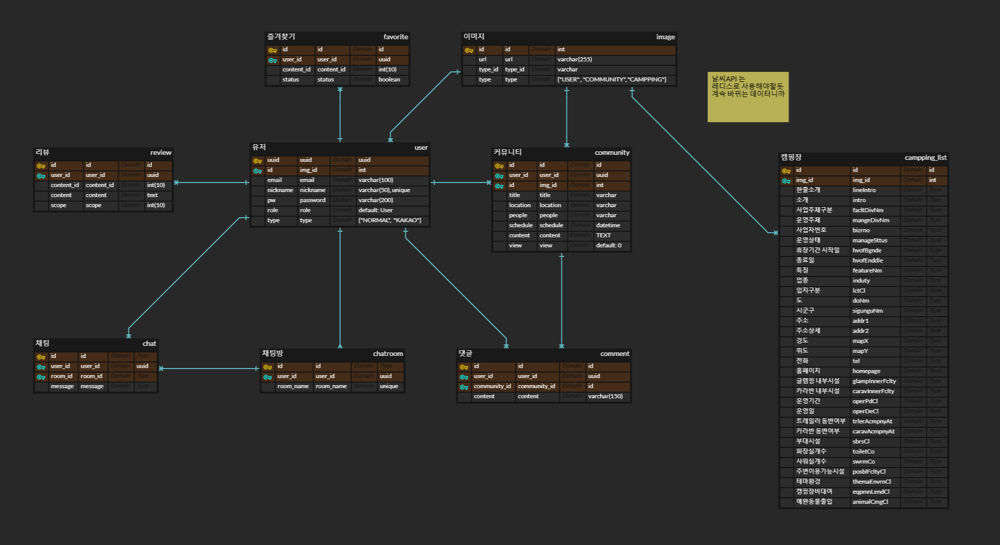

## 4.2 로그인 & 로그아웃 API 설계 구조(시퀀스 다이어그램)

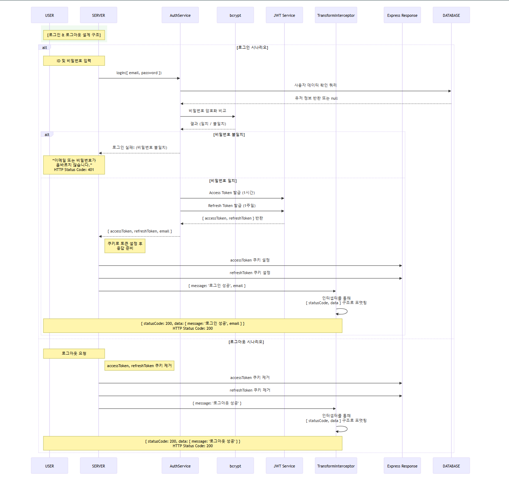

## 4.3 OAuth 전략 (시퀀스 다이어그램)

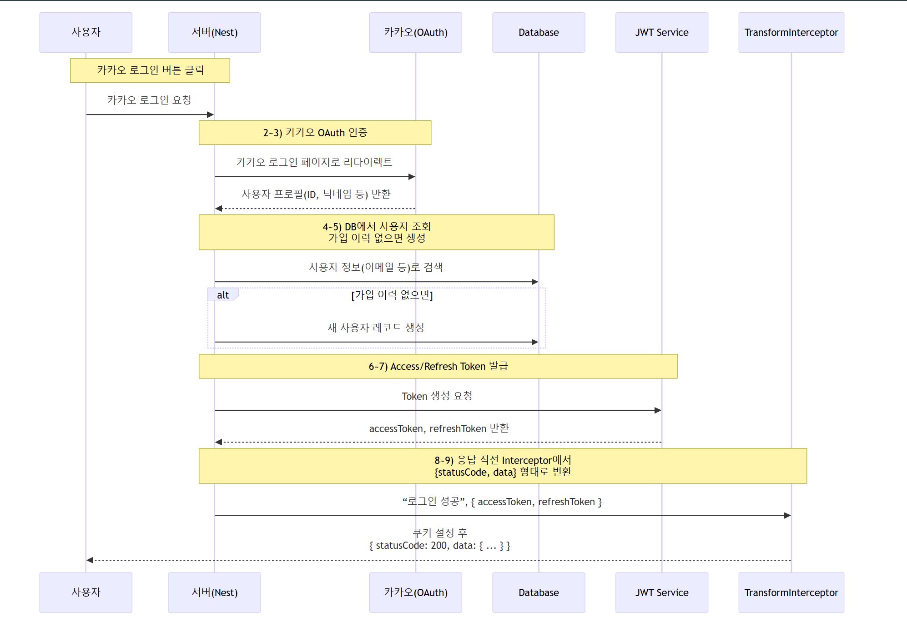

## 4.4 시스템 아키텍처


<br/>

# 5. 화면 구성 📺

|                      로그인 페이지                      |                     회원가입 페이지                      |                  리스트 페이지                  |
| :-----------------------------------------------------: | :------------------------------------------------------: | :---------------------------------------------: |
|    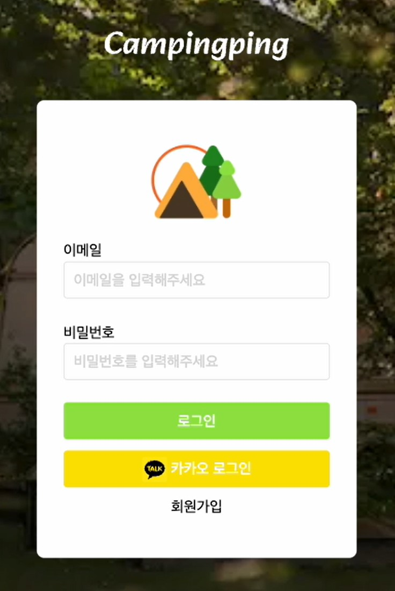     |    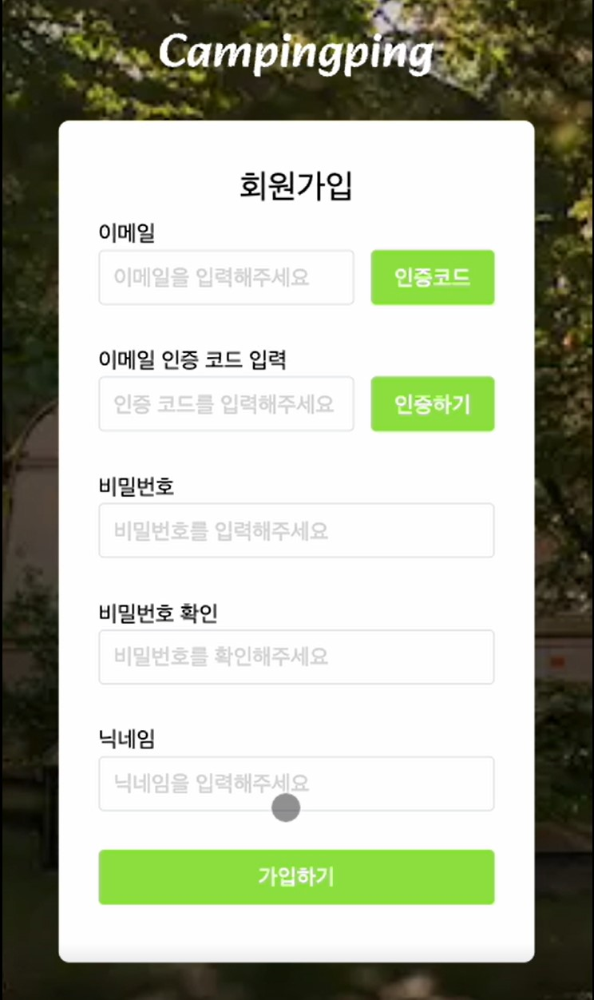     | 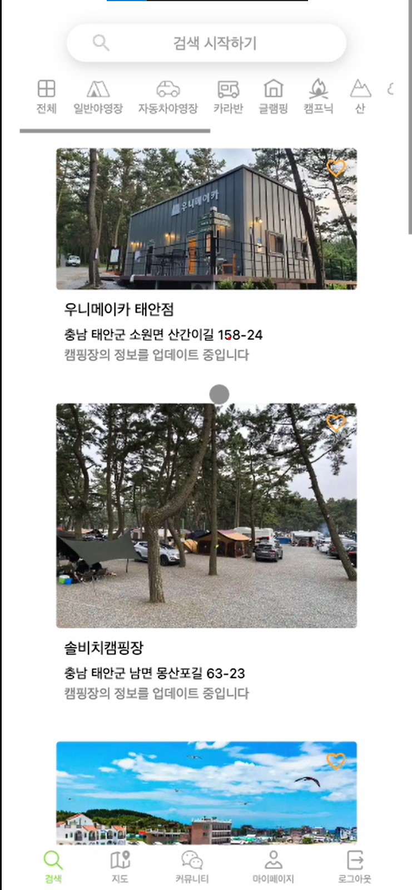 |
|                   리스트 상세 페이지                    |                    지역 필터링 페이지                    |                   지도 페이지                   |
| 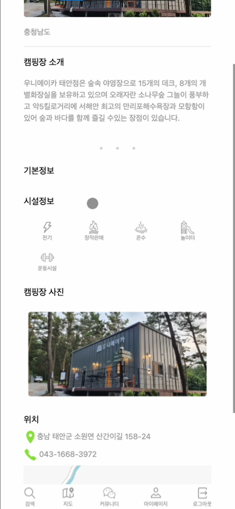  |    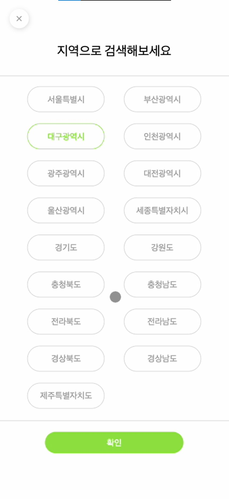     | 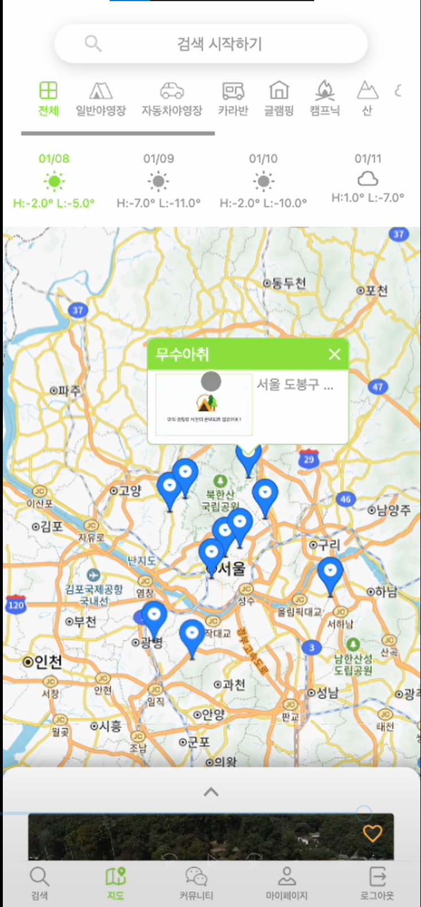  |
|               커뮤니티 페이지 (내 게시물)               |              커뮤니티 페이지 (전체 게시물)               |                   채팅 페이지                   |
| 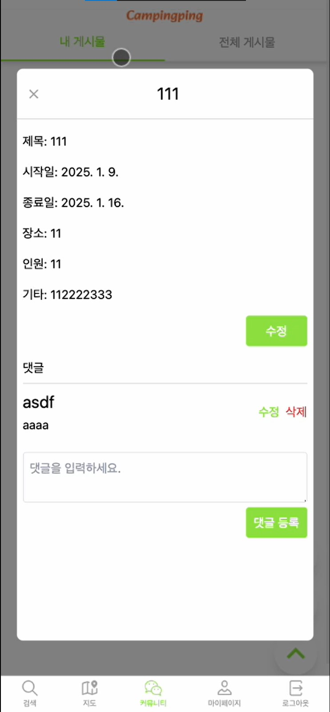 | 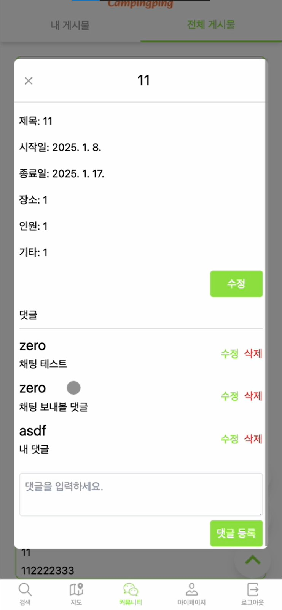 | 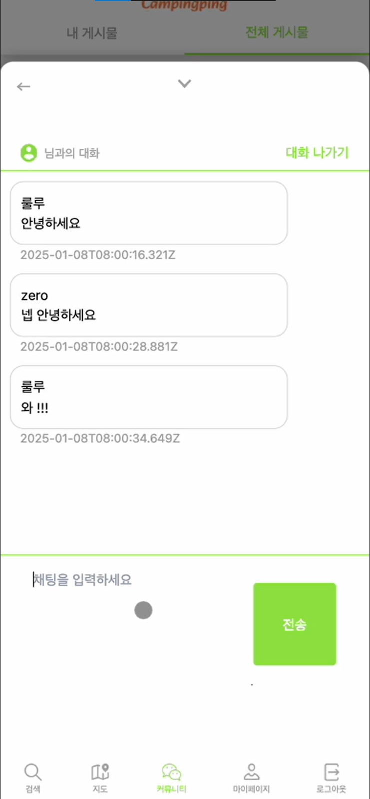 |

---

# 6. Tasks & Responsibilities (작업 및 역할 분담)

|        |                                                            |                                                                                                                                              |
| ------ | ---------------------------------------------------------- | -------------------------------------------------------------------------------------------------------------------------------------------- |
| 김영현 |   | <ul><li>유저 API(JWT, 인증, 인가, 이미지)</li><li>웹소켓 채팅</li><li>커뮤니티 API</li><li>즐겨찾기 API</li><li>CI & CD 구축</li></ul>       |
| 백기준 |  | <ul><li>캠핑 공공 API 관리</li><li>캠핑 API</li><li>캠핑 이미지 API</li><li>커뮤니티 API</li><li>CI & CD 구축</li></ul>                      |
| 김지연 |   | <ul><li>로그인, 회원가입 페이지</li><li>검색 페이지</li><li>지도 페이지</li><li>채팅 페이지</li><li>버튼, 인풋, 카드 컴포넌트 제작</li></ul> |
| 최준영 |  | <ul><li>커뮤니티 페이지</li><li>날씨 컴포넌트 제작</li></ul>                                                                                 |

<br/>
<br/>

## 6.1 주요 작업

- 프로젝트의 도메인에 관한 ERD를 설계하고, 즐겨찾기, 커뮤니티, 유저 등의 **CRUD API를 개발**했습니다.
- **AWS EC2**와 **Docker, Docker Hub**를 이용해 백엔드 인프라를 구성하고 , **Github Actions**로 **CI/CD 파이프라인**을 자동화하여 배포 효율성과 안전성을 강화했습니다.
- 채팅 기능 구현 중 **WebSocket, HTTP, DB** 등 다양한 곳에서 발생하는 에러를 추적하기 어려운 문제가 있다는 것을 인지하고, 이를 해결하기 위해 에러를 체계적으로 관리하고 디버깅 할 수 있는 **AppError** 클래스를 설계하여 표준화된 에러 유형, 상태 코드, 자동 포착 및 처리 기능을 구현했습니다.
- 인증/인가 로직을 설계하면서, 쿠키에 **JWT** 토큰을 담아주는 방식으로 구현해 **XSS**를 방지하고, **Redis**와 **nodemailer**를 활용한 이메일 인증 번호 확인 방식을 추가해 보안성과 확장성을 강화했습니다.
- 카카오 소셜로그인 기능을 설계하며 , 전략 패턴을 사용하여 **OCP**를 준수해서 기존 코드 수정 없이 새로운 인증 전략을 확장 가능한 구조로 구현하여 확장성을 높였습니다.
- 실시간 메시지 전송과 데이터 일관성 유지가 중요한 채팅 시스템의 특성을 고려해, **Socket.IO**를 활용해 **WebSocket** 기반 채팅 시스템을 설계하고, **QueryRunner**를 활용해 WebSocket 요청마다 트랜잭션을 생성하여 데이터의 무결성과 안전성을 확보했습니다.

<br/>

# 7. Technology Stack (기술 스택)

## 7.1 Frontend

| 기술 스택       | 설명                                                                           | 로고                                                                                                                        |
| --------------- | ------------------------------------------------------------------------------ | --------------------------------------------------------------------------------------------------------------------------- |
| **Next.js**     | React 기반의 서버 사이드 렌더링 및 정적 웹사이트 생성을 위한 프레임워크입니다. |             |
| **TailwindCSS** | 빠르고 유연한 스타일링을 위한 유틸리티 중심의 CSS 프레임워크입니다.            |  |
| **TypeScript**  | JavaScript에 정적 타입을 추가하여 코드의 안정성을 높이는 언어입니다.           |      |
| **Zustand**     | 전역 상태 관리를 위한 간단하고 빠른 상태 관리 라이브러리입니다.                |               |
| **Docker**      | 애플리케이션을 컨테이너로 패키징, 배포, 실행하기 위한 도구입니다.              |                  |

<br/>

## 7.2 Backend

| 기술 스택      | 설명                                                                                 | 로고                                                                                                                    |
| -------------- | ------------------------------------------------------------------------------------ | ----------------------------------------------------------------------------------------------------------------------- |
| **Nest.js**    | 효율적이고 확장 가능하며 잘 구조화된 서버 애플리케이션 개발을 위한 프레임워크입니다. |            |
| **TypeScript** | JavaScript에 정적 타입을 추가하여 코드의 안정성을 높이는 언어입니다.                 |  |
| **TypeORM**    | TypeScript 기반의 객체 관계형 매핑(ORM) 라이브러리입니다.                            |           |
| **PostgreSQL** | 안정적이고 확장 가능하며 관계형 데이터 저장을 지원하는 데이터베이스입니다.           |  |
| **Socket.io**  | 실시간 양방향 통신을 위한 라이브러리입니다.                                          |     |
| **Redis**      | 빠른 데이터 처리를 위한 인메모리 데이터 저장소입니다.                                |                 |
| **Swagger**    | API 문서를 자동으로 생성하는 도구입니다.                                             |           |
| **Docker**     | 애플리케이션을 컨테이너로 패키징, 배포, 실행하기 위한 도구입니다.                    |              |

<br/>

## 7.3 Cloud & Infrastructure

| 기술 스택          | 설명                                                                      | 로고                                                                                                                                 |
| ------------------ | ------------------------------------------------------------------------- | ------------------------------------------------------------------------------------------------------------------------------------ |
| **AWS EC2**        | 가상 서버를 제공하는 클라우드 컴퓨팅 서비스입니다.                        |                    |
| **AWS S3**         | 확장 가능하고 안전한 객체 저장을 제공하는 클라우드 스토리지 서비스입니다. |                     |
| **GitHub Actions** | 지속적인 통합 및 배포 워크플로를 자동화하기 위한 도구입니다.              |  |
| **Prometheus**     | 시스템 모니터링 및 알림을 위한 오픈소스 도구입니다.                       |               |
| **Grafana**        | 데이터 시각화를 위한 대시보드 및 모니터링 도구입니다.                     |                        |

<br/>

## 7.4 Cooperation

| 도구    | 로고                                                                                                         |
| ------- | ------------------------------------------------------------------------------------------------------------ |
| Git     |               |
| GitLab  |      |
| Notion  |  |
| Discord |         |

<br/>

# 8. Project Structure (프로젝트 구조, 백엔드)

```plaintext
BACK/
├── .github/workflows/     # GitHub Actions 워크플로 파일
├── dist/                  # 빌드된 파일
├── node_modules/          # 설치된 npm 모듈
├── README.asset           # README에 사용된 에셋 파일
├── src/
│   ├── auth/              # 인증 관련 모듈
│   ├── camping/           # 캠핑 관련 모듈
│   ├── chat/              # 채팅 관련 모듈
│   ├── comment/           # 댓글 관련 모듈
│   ├── common/            # 공통 모듈
│   ├── community/         # 커뮤니티 관련 모듈
│   ├── config/            # 환경 설정 파일
│   ├── database/          # 데이터베이스 설정 및 연결
│   ├── favorite/          # 즐겨찾기 관련 모듈
│   ├── image/             # 이미지 처리 관련 모듈
│   ├── migrations/        # 데이터베이스 마이그레이션 파일
│   ├── review/            # 리뷰 관련 모듈
│   ├── user/              # 사용자 관련 모듈
│   ├── app.controller.ts  # 메인 애플리케이션 컨트롤러
│   ├── app.module.ts      # 메인 애플리케이션 모듈
│   ├── app.service.ts     # 메인 애플리케이션 서비스
│   └── main.ts            # 애플리케이션 진입 파일
├── test/                  # 테스트 관련 파일
├── .env                   # 환경 변수 파일
├── .eslintrc.js           # ESLint 설정 파일
├── .gitignore             # Git에서 무시할 파일 및 폴더 목록
├── .prettierrc            # Prettier 설정 파일
├── docker-compose.yml     # Docker Compose 설정 파일
├── Dockerfile             # Docker 설정 파일
├── nest-cli.json          # NestJS CLI 설정 파일
├── package-lock.json      # 정확한 종속성 버전 기록 파일
├── package.json           # 프로젝트 종속성 및 스크립트 정의
├── README.md              # 프로젝트 개요 및 사용법
├── tsconfig.build.json    # 빌드 시 TypeScript 설정 파일
└── tsconfig.json          # TypeScript 설정 파일

```

<br/>
<br/>

## 명명 규칙

- 변수 & 함수 : 카멜케이스

<br/>

# 9. 커밋 컨벤션

## 기본 구조

```
type : subject
```

<br/>

## type 종류

```
feat : 새로운 기능 추가
fix : 버그 수정
docs : 문서 수정
style : 코드 포맷팅, 세미콜론 누락, 코드 변경이 없는 경우
refactor : 코드 리펙토링
test : 테스트 코드, 리펙토링 테스트 코드 추가
chore : 빌드 업무 수정, 패키지 매니저 수정
```

<br/>

<br/>

## 커밋 예시

```
== ex1
feat: "회원 가입 기능 구현"

== ex2
fix: "DB연결 에러 해결"
```

<br/>

## 🛠 시연 영상

[시연 영상 ](https://youtu.be/dC5v-PPcN1Q)
<br/>
<br/>
